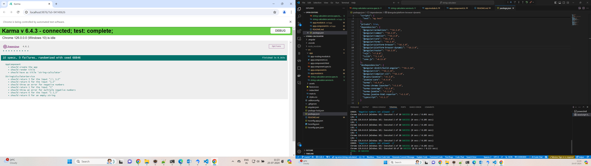

# String Calculator TDD Kata

## Overview

The String Calculator TDD Kata is a test-driven development exercise that involves creating a simple calculator that can process a string of numbers and perform addition. The goal is to build the functionality incrementally while adhering to TDD principles.

## Features

- **Add** method that takes a string of numbers and returns their sum.
- Handles comma-separated numbers.
- Supports new lines as delimiters.
- Allows custom delimiters.
- Throws an error for negative numbers and lists all negative numbers in the error message.

## Installation

1. **Clone the Repository**

   ```
   git clone 

   cd string-calculator

   Install Dependencies   - npm install
   ng test
   ```

## Implementation Details

**StringCalculatorService**

**This service provides the add method with the following behavior**:

- Empty string: Returns 0.
- Single number: Returns the number itself.
- Comma-separated numbers: Returns the sum of the numbers.
- New lines: Supports new lines as delimiters.
- Custom delimiters: Supports custom delimiters specified at the start of the string.
- Negative numbers: Throws an exception with a message listing all negative numbers.


# Test Cases
The test cases for the add method cover various scenarios. Below is a summary of the test cases

` Test Cases
Empty String
`
```
Input: ""
Output: 0
Description: Returns 0 when the input string is empty.
Single Number
```

```
Input: "1"
Output: 1
Description: Returns the number itself when a single number is provided.
Comma-Separated Numbers
```
```
Input: "1,5"
Output: 6
Description: Returns the sum of numbers separated by commas.
New Lines as Delimiters
```
```
Input: "1\n2,3"
Output: 6
Description: Supports new lines as delimiters along with commas.
Custom Delimiters
```
```
Input: "//;\n1;2"
Output: 3
Description: Supports custom delimiters specified at the beginning of the string.
Negative Numbers
```
```
Input: "1,-2"

Output: Error: Negative numbers not allowed: -2

Description: Throws an error for negative numbers and lists them.
```
```
Input: "1,-2,-3"

Output: Error: Negative numbers not allowed: -2, -3

Description: Throws an error for multiple negative numbers and lists them.
```
## Test Cases Screenshot
Below is a screenshot illustrating the test cases:


